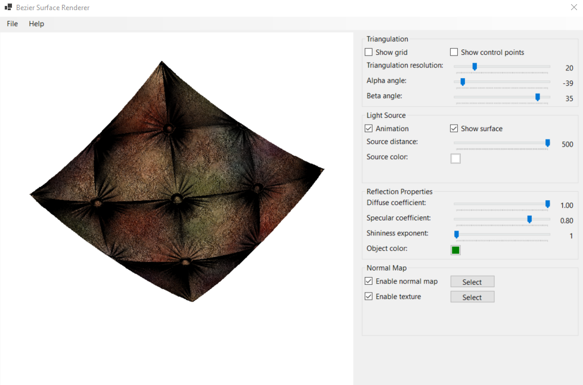

# Bézier Surface Renderer:

Bézier Surface Renderer is a simple 3D rendering tool for visualizing and manipulating a cubic Bézier surface in real-time.

The project was implemented as a part of the Computer Graphics course at Warsaw University of Technology during the winter semester of the 2024-2025 academic year.

The surface supports interactive rotation and parameter adjustments. Texture mapping and normal vector mapping are also included to enhance surface details.

  

## Features:

- **File Input**: Bézier surface configurations are loaded from structured text files containing 16 control points allowing smooth curvature control.
- **Triangulation**: The program renders the surface by dividing it into triangles. The number of triangles can be adjusted using an interactive UI.
- **Lambertian Lighting Model**: User can modify all lighting parameters (e.g. diffuse coefficient, specular coefficient, shininess exponent and light color) using sliders and buttons.
- **Texture Mapping**: Textures can be loaded from image files and applied directly to the Bézier surface, giving it a realistic appearance.
- **Normal Mapping**: Normal maps can be applied to alter the surface normals, simulating finer surface details and depth for enhanced lighting effects.
- **Animation**: User can turn on the animation mode, making the light source move in circles, creating dynamic lighting effects across the surface.
- **3D Rotation**: The surface can be interactively rotated around the X and Z axes.

  

  

  

